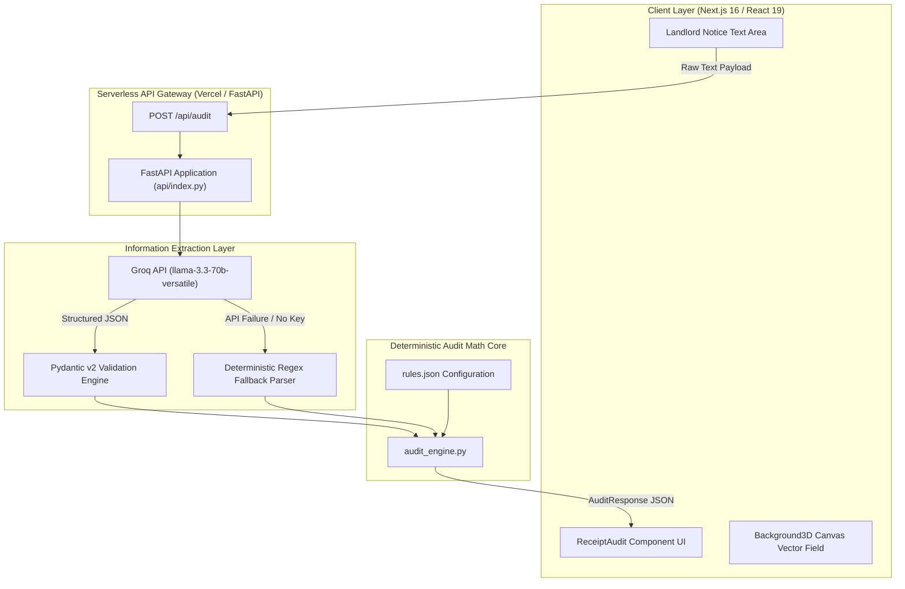

```
 ____  _____ ____   ___  ____ ___ _____ ____  _____ ____   ____ _   _ _____ 
|  _ \| ____|  _ \ / _ \/ ___|_ _|_   _|  _ \| ____/ ___| / ___| | | | ____|
| | | |  _| | |_) | | | \___ \| |  | | | |_) |  _| \___ \| |   | | | |  _|  
| |_| | |___|  __/| |_| |___) | |  | | |  _ <| |___ ___) | |___| |_| | |___ 
|____/|_____|_|    \___/|____/___| |_| |_| \_\_____|____/ \____|\___/|_____|
```

> **AUTOMATED SECURITY DEPOSIT DISPUTE & STATUTORY RECOVERY AUDIT ENGINE**

---


---

### 📊 Operational Diagnostics & Pipeline Status

```
[ AUDIT PIPELINE ] ========================================= [ 100% OPERATIONAL ]
[ STATUTORY LOGIC ] [ ████████████████████████████████████ ] ACTIVE (2.0x PENALTY)
[ LLM STRUCTURING ] [ ████████████████████████████████████ ] GROQ PYDANTIC V2
[ REGEX FALLBACK  ] [ ████████████████████████████████████ ] ZERO-DEPENDENCY READY
```

---

## 1. The Domain & Objective (Vertical)

**DepositRescue** is built for the **Residential Real Estate / PropTech / LegalTech** vertical, specifically targeting **Tenant Rights Enforcement** and **Small Claims Litigation**.

### The Core Problem Space
In residential leasing, tenants routinely face **information asymmetry** and **systemic deposit overcharging** upon tenancy termination. Landlords and property management firms frequently issue itemized move-out deduction notices that improperly shift standard property turnover operational overhead—such as interior wall repainting, carpet steam cleaning, nail hole patching, and routine wear and tear—onto exiting tenants. 

Under governing statutory tenant protection frameworks (e.g., California Civil Code § 1950.5, New York General Obligations Law § 7-108, and comparable municipal statutes), landlords are **strictly prohibited** from withholding funds for normal wear and tear resulting from ordinary habitation. Furthermore, bad-faith or unlawful withholdings expose landlords to statutory damages, often calculated as a **2.0x penalty multiplier** on the wrongfully withheld amount.

Despite these legal protections, tenants rarely dispute unlawful deductions because:
1. Itemized notices are delivered as unformatted prose, invoices, or manual ledger notes, making manual legal verification tedious.
2. Most tenants lack real-time access to statutory legal definitions differentiating **tenant-caused property damage** from **routine landlord wear and tear**.
3. Retaining legal counsel for small claims amounts ($100–$3,000) is economically unviable.

### The High-Leverage Solution
**DepositRescue** provides a high-leverage, zero-friction automated audit platform that ingests arbitrary, unstructured landlord move-out statements, extracts line-item charges via structured NLP inference, and applies a **deterministic mathematical audit ruleset**. The system zero-outs illegal maintenance deductions, highlights statutory violations with visual red strikethrough telemetry, and computes exact **statutory recovery totals recoverable in small claims court**.

---

## 2. System Architecture & Core Logic (Approach)

The platform utilizes a modern, decoupled **hybrid architecture** combining an ultra-responsive Next.js 16 frontend with a Python FastAPI serverless execution layer on Vercel.



### Architectural Breakdown

#### 1. Presentation & Interaction Layer
* **Framework**: Built on **Next.js 16.3.6** (App Router) and **React 19.0.0**, utilizing **Tailwind CSS v4** for styling and **Framer Motion v12** for layout animations.
* **Multi-Plane Render Architecture**:
  * **Layer 1 (Deep Background)**: Implements `Background3D`, generating a floating geometric canvas backdrop driven by scroll position (`useScroll`) and real-time mouse cursor vector fields (`useMotionValue`, `useSpring`).
  * **Layer 2 (Midground Input Plane)**: Implements `ReceiptAudit`, a glassmorphic card container (`backdrop-blur-2xl`) hosting the text ingestion engine, character metrics counter, payload validation, and sample notice triggers.
  * **Layer 3 (Foreground Ledger & Recovery Counter)**: Renders an editorial ledger detailing audited line items. Unlawful charges feature dynamic SVG path strikethroughs, badge indicators, original vs. adjusted financial comparisons, and statutory recovery counter widgets.

#### 2. Information Extraction & Pipeline Resiliency Layer
* **Structured LLM Parsing**: Leverages **Groq API** running `llama-3.3-70b-versatile` with low temperature (`0.1`) and forced `json_object` output mode. The raw text is parsed into strict **Pydantic v2 schemas** (`ExtractedLLMResponse`, `RawDeductionItem`).
* **Zero-Dependency Deterministic Fallback**: In production environments where `GROQ_API_KEY` is not present, rate-limited, or timing out (>15s), the system seamlessly executes `fallback_regex_extractor()`. This regex engine parses dollar amounts (`$XXX.XX` / `USD XXX`) and preceding/succeeding item descriptors without external dependencies.

#### 3. Deterministic Statutory Audit Core
* **Isolation of Business Logic**: LLM outputs are **never trusted** to perform legal financial calculations directly. LLMs handle unstructured text parsing only, while business calculations are delegated to a 100% deterministic mathematical rules engine (`audit_engine.py`).
* **Statutory Rules Engine (`rules.json`)**: Configured with a keyword pattern registry (`routine_maintenance_flags`) targeting standard routine maintenance terms:
  ```json
  [
    "painting", "touch up paint", "interior paint", "wall scuff",
    "cleaning", "routine cleaning", "carpet cleaning", "steam cleaning",
    "wear and tear", "normal wear", "nail holes", "aging appliances",
    "light bulb", "faucet washer", "hvac filter", "grout discoloration"
  ]
  ```
* **Audit Calculation Logic**:
  For each line item $i$ with extracted cost $C_i$:
  $$\text{adjusted\_cost}_i = \begin{cases} 0.0 & \text{if } \text{category}_i \lor \text{name}_i \text{ matches any routine flag} \\ C_i & \text{otherwise} \end{cases}$$
  $$\text{illegal\_total} = \sum_{i \in \text{illegal}} C_i$$
  $$\text{allowed\_total} = \text{raw\_total} - \text{illegal\_total}$$
  $$\text{statutory\_recovery} = \text{illegal\_total} \times \text{statutory\_multiplier} \quad (\text{Default } 2.0\times)$$

---

## 3. Execution Flow (How it Works)

The end-to-end data lifecycle proceeds through six distinct stages:

```
[User Text Input] ──> [Next.js API Handler] ──> [Groq / Regex NLP]
                                                      │
                                                      ▼
[Statutory Recovery Output] <── [React Render Engine] <── [Deterministic Audit Engine]
```

1. **Application Initialization & Cold Start**:
   * The Next.js App Router renders the shell page.
   * On serverless cold start, the Python runtime initializes `api/index.py` and reads statutory rules (`rules.json`) into memory via `load_rules()`.

2. **Dispute Notice Payload Submission**:
   * The user pastes a landlord move-out statement into `ReceiptAudit` or triggers `LOAD SAMPLE NOTICE`.
   * Client-side validation asserts non-empty content before setting `loading = true`.

3. **HTTP API Request Dispatch**:
   * The client sends a `POST` JSON request containing `{ "text": "..." }` to `/api/audit`.
   * If `/api/audit` returns `404` (local dev environment variant), the client gracefully retries `/api/py/audit`.

4. **Structured NLP Extraction**:
   * `index.py` receives `AuditRequest` and executes `extract_deductions_from_text()`.
   * **Primary Path**: Groq API invokes `llama-3.3-70b-versatile`, transforming raw prose into structured Pydantic v2 JSON items.
   * **Secondary Path**: If Groq API key is missing or fails, regex parser extracts items using numerical string boundary rules.

5. **Deterministic Statutory Audit Execution**:
   * `audit_engine.py` iterates through each item, standardizing string cases.
   * Items matching routine flags are flagged (`is_routine_maintenance = True`, `is_illegal = True`), their cost is zeroed (`adjusted_cost = 0.0`), and statutory legal violation explanations are attached.
   * The engine computes total claimed amount (`raw_total`), total illegal withholdings (`illegal_total`), allowed legitimate damages (`allowed_total`), and total recoverable statutory damages (`statutory_recovery = illegal_total * 2.0`).

6. **Client-Side Visual Rendering & Animation Pipeline**:
   * The client receives the structured `AuditResponse` payload.
   * **Framer Motion** triggers layout transitions:
     * Red strike-through line paths scale across illegal item text (`strike-red`).
     * Original costs are crossed out and animated to `$0.00` in emerald font.
     * Illegal items render warning callout badges (`ILLEGAL DEDUCTION`).
     * The statutory penalty counter populates with a `$XX.XX` recoverable estimate.

---

## 4. Technical Assumptions & Constraints

### Prerequisites & Runtime Specifications

| Category | Component / Dependency | Required Version / Specification |
| :--- | :--- | :--- |
| **Node.js Environment** | Node.js Engine | `v18.18.0` or `v20.x`+ |
| **Package Manager** | npm / pnpm | `npm 10.x` or `pnpm 8.x`+ |
| **Python Runtime** | Python Language Interpreter | `Python 3.10+` (Tested up to `3.14`) |
| **Frontend Framework** | Next.js / React | `Next.js 16.3.6`, `React 19.0.0` |
| **UI Motion Engine** | Framer Motion | `framer-motion ^12.4.10` |
| **Styling Engine** | Tailwind CSS / PostCSS | `@tailwindcss/postcss ^4.0.0` |
| **API Framework** | FastAPI / Pydantic | `fastapi ^0.115.0`, `pydantic ^2.10.0` |
| **LLM Provider** | Groq SDK | `groq ^0.9.0` (`llama-3.3-70b-versatile`) |

### Explicit Architectural & Environmental Constraints

1. **Stateless Processing Architecture**:
   * DepositRescue operates as a **zero-persistence, stateless audit service**. No tenant financial statements or parsed landlord deduction data are stored to disk or database tables, ensuring total privacy.

2. **LLM Non-Determinism Guardrails**:
   * LLM inference is strictly scoped to text extraction. All arithmetic operations, cost zeroing, and statutory penalty calculations are executed by the deterministic Python core (`audit_engine.py`), preventing LLM hallucination errors in financial output.

3. **Fallback Parser Limitations**:
   * The regex fallback parser assumes landlord notices contain explicit currency symbols (`$`) or ISO currency tags (`USD`) adjacent to numerical deductions. Complex prose lacking numerical markers requires the Groq LLM extraction path.

4. **Jurisdictional Rule Configuration**:
   * The default ruleset in `rules.json` enforces a standard **2.0x statutory penalty multiplier**. State-specific adjustments (e.g., 3.0x under specific municipal housing codes) require updating `statutory_multiplier` in `rules.json`.

---

<p align="center">
  <b>DepositRescue System Architecture</b> &bull; Built with Next.js 16, React 19, FastAPI & Groq LLM
</p>
